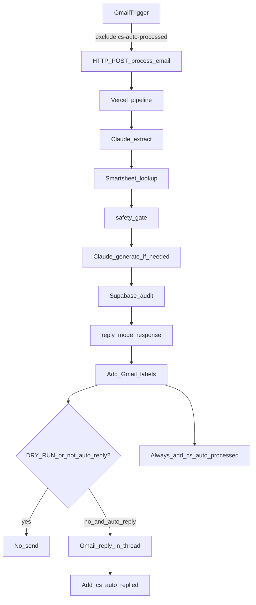

# Moss Home CS Email Automation — v1 Plan (Revised)

## Philosophy shift from original spec

The original Build Spec v2 aimed for broad auto-reply on day one. **v1 is intentionally narrower and safer**, informed by Zapier failure modes:

- **WISMO / order-status golden path first** — exact AMP Order #, Customer PO #, or Invoice # matches only
- **Dry-run / label-only first** — no Gmail send until Jacq reviews Supabase logs
- **Deterministic safety gate** in code (`lib/safety.ts`) — not just prompt instructions
- **Human review** for COM, quotes, yardage, complaints, client-name-only, pending materials, missing tracking, and anything ambiguous

Architecture unchanged: **n8n = Gmail + HTTP + labels + send**; **Vercel = all business logic**; **Smartsheet = source of truth**; **no Smartsheet in n8n**.

---

## Critical correction: Smartsheet Sheet ID (verify at build, do not trust)

```env
SMARTSHEET_SHEET_ID=6535661298706308   # candidate — UNVERIFIED, supplied by ChatGPT
```

The URL segment `jWf9j76hq8MjX7FQ9H55h6jRg94fg6vx4FGJX6R1` is a **share slug**, not the API sheet ID. All Smartsheet API calls use a numeric ID.

**Build step zero:** call `GET https://api.smartsheet.com/2.0/sheets` with the API token, list all sheets the token can see, and confirm the correct sheet by name before hardcoding any ID. The numeric ID above came from an LLM suggestion and must not be trusted until verified — trusting unverified IDs is the Zapier failure mode in new clothes.

**Confirmed from Douglas's screenshot (Jun 9):** the target sheet is named **"MASTER: Open Orders Sheet"**. Visible real columns include: `AMP Order #`, `Invoice #` (appears twice — sync script must disambiguate by column ID), `ACCOUNT EMAIL` (the email column — not "Customer Email" as the old AMP mapping doc assumed), `Territory Mgr`, `TM Email`, `SKU`, `Item Name`, `Moss Fabric`. Sample identifiers seen: AMP Order `112525-3604`, Invoice `30280`. Douglas created a dedicated API token named "NBN Customer Service Automation".

---

## Environment variables

### Vercel

```env
ANTHROPIC_API_KEY=
SMARTSHEET_API_TOKEN=          # you have this
SMARTSHEET_SHEET_ID=6535661298706308
SUPABASE_URL=
SUPABASE_SERVICE_ROLE_KEY=
PROCESS_API_SECRET=            # shared with n8n bearer
DRY_RUN=true                   # start here; flip to false after Jacq review
```

### n8n (Moss Home–scoped only)

- `Moss Home - Gmail (CS Inbox)` → `support@mosshomeusa.com`
- `Moss Home - Process API (HTTP Header Auth)` → `Bearer <PROCESS_API_SECRET>`
- **No Smartsheet credential in n8n**

---

## Architecture



---

## API contract (replaces simple status=replied)

### `POST /api/process-email`

**Request** (from n8n):

```ts
type ProcessEmailRequest = {
  messageId: string;
  threadId: string;
  from: string;
  to: string;
  subject: string;
  textBody: string;
  htmlBody?: string;
  date?: string;
  labels?: string[];
};
```

**Response** (to n8n):

```ts
type ProcessEmailResponse = {
  messageId: string;
  threadId: string;
  reply_mode: "auto_reply" | "draft_only" | "human_review" | "ignore";
  intent: /* order_status | tracking_status | estimated_completion | com_received_status | ... */;
  extracted: { ampOrderNumber?, poNumber?, invoiceNumber?, clientName?, projectName?, ... };
  match: {
    found: boolean;
    matchType?: "amp_order" | "customer_po" | "invoice" | "client_project" | "customer_email";
    matchedKey?: string;
    matchedColumn?: string;
    rowId?: string;
    confidence: "high" | "medium" | "low" | "none";
    multipleMatches: boolean;
    candidateCount?: number;
  };
  reply?: string;
  reason: string;
  askedForInfo: boolean;
  dryRun: boolean;
};
```

**n8n sends Gmail reply only when** `reply_mode === "auto_reply"` **and** `DRY_RUN !== true`.

Implementation note: Vercel computes the true intended mode always; when `DRY_RUN=true`, response includes `dryRun: true` and n8n suppresses send regardless of `reply_mode`. This lets Jacq see what *would* have auto-replied.

---

## Repository structure

```
moss-cs-automation/
  app/api/process-email/route.ts
  app/api/health/route.ts
  lib/auth.ts
  lib/types.ts
  lib/email-cleanup.ts       # strip signatures, normalize body
  lib/smartsheet.ts          # row fetch + field access
  lib/smartsheet-columns.ts  # generated by sync script
  lib/matching.ts            # priority lookup logic
  lib/claude.ts
  lib/pipeline.ts            # linear: cleanup → extract → match → safety → generate
  lib/safety.ts              # deterministic reply_mode gate
  lib/supabase.ts
  prompts/extract.ts
  prompts/generate.ts
  scripts/sync-smartsheet-columns.ts
  n8n/moss-home-cs-auto-reply.json
  tests/fixtures/emails.ts
  tests/smartsheet.test.ts
  tests/extract.test.ts
  tests/pipeline.test.ts
  MOSS_HOME_CS_AUTOMATION_SPEC.md
```

---

## Smartsheet: column sync + lookup

### Step 1: Inspect before assuming column locations

Run `scripts/sync-smartsheet-columns.ts` against sheet `6535661298706308`:

```
GET /sheets/{SMARTSHEET_SHEET_ID}
```

Generate `lib/smartsheet-columns.ts` mapping **column titles → column IDs**. Minimum columns to resolve:

- AMP Order #, Customer PO #, Invoice #, Customer, Customer Email
- **Estimated Shipping** (customer-facing) — never Est Ship Week in replies
- Order Status, Tracking / Tracking #, Shipped Date
- Moss Fabric, Item, Piece, SKU, COM, Material, Notes (if present)

**Campe lesson from Zapier:** project/end-client names (e.g. "Campe") may live in **Customer PO #** or another non-obvious field, while `Customer` shows the dealer (e.g. "JLV Creative"). Before implementing fuzzy client lookup, inspect 5–10 real rows and document which columns hold project/end-client values.

### Step 2: Lookup priority (`lib/matching.ts`)

1. AMP Order # — exact (`\d{6}-\d{3,5}` or `156182-w\d{6}`)
2. Customer PO # — exact
3. Invoice # — exact (careful with bare 5-digit false positives; prefer invoice-context terms)
4. Confirmed client/project columns only (after inspection)
5. Customer Email — exact

**v1 rule:** Only `amp_order`, `customer_po`, `invoice` exact matches with `confidence: high` and `multipleMatches: false` may reach `auto_reply`. Client/project/email-only matches → `human_review`.

### Step 3: Field rules in replies

| Condition | Behavior |
|---|---|
| Tracking column has value | Say shipped; include tracking; no "estimated for completion" |
| Order Status = shipped but no tracking | `human_review` — do not invent tracking |
| Order Status contains Pending Materials / COM pending / Awaiting Fabric / etc. | `human_review` — do not give normal completion estimate |
| Estimated Shipping populated, production proceeding | "Your order is currently estimated for completion in [value]." |
| Est Ship Week | Never use in customer-facing text |
| Wording | "estimated for completion" — never "scheduled to ship" |
| Signature | `Best,\nMoss Home Customer Service` — no em dashes |

---

## Safety gate (`lib/safety.ts`)

Deterministic logic after extract + match (not left to the model):

```
if spam/unrelated → ignore
else if unsafeSignals (complaint, damage, return, cancellation, address change, legal, angry) → human_review
else if intent in (quote_request, yardage_request, com_received_status, fabric_status) → draft_only | human_review
else if intent in (order_status, tracking_status, estimated_completion)
     AND match.found AND confidence=high AND !multipleMatches
     AND matchType in (amp_order, customer_po, invoice):
       if pendingMaterials → human_review
       else if shippedButTrackingMissing → human_review
       else → auto_reply
else if multipleMatches OR !match.found → human_review
else → draft_only
```

COM/fabric received emails: lookup row for audit context, but **do not auto-send in v1** unless a confirmed receipt-status column exists.

### Forwarded-email handling (dominant real-world pattern)

Most example emails are **Jacq or staff forwarding** a customer email to `support@` (`Fwd:` subjects from `jacq@mosshomeusa.com`, reps at codarus.com, etc.). An in-thread reply goes to the **forwarder**, not the end customer. Rules:

- Detect forwarded messages (internal/known-rep sender + `Fwd:` subject or forwarded-message markers).
- Extraction runs against the **embedded original message** (the customer's actual question), not the forwarder's signature block.
- **Default (Douglas skipped the question, revisit anytime):** reply in-thread to the forwarder — they forwarded to support@ expecting an answer, so the reply reaching them is correct behavior. The safety gate still applies; only clean WISMO exact matches auto-reply. Dry-run review will confirm this feels right before anything sends.
- Self-protection: never process emails sent **by** the automation itself or from no-reply/automated senders (skip-list in `lib/safety.ts`).

### No-match vs. data-gap distinction

The sheet is populated by Data Shuttle from AMP's "last 30 days" export. A valid order number can be absent from the sheet (sync lag, order older than the sync window). These must be distinguishable in the audit log:

- `match_type: none` + no identifiers extracted → ask-for-info territory
- **Identifier extracted but no row found** → `human_review` with `reason: "valid-format identifier found but no Smartsheet row — possible Data Shuttle sync gap"` — this metric surfaces sheet-freshness problems before customers do.

---

## Extraction (`prompts/extract.ts`)

Structured JSON including `unsafeSignals`:

```ts
{
  intent, ampOrderNumber?, poNumber?, invoiceNumber?,
  clientName?, projectName?, customerEmail?, materialOrComReference?,
  secondaryQuestions?, unsafeSignals: { complaint, damage, returnOrRefund, ... }
}
```

Identifier regexes per build prompt (AMP `\d{6}-\d{3,5}`, desktop `156182-w\d{6}`, PO variants, invoice context rules).

**Output hardening:** validate every Claude JSON response against a Zod schema. On parse/validation failure, retry once with the error appended; on second failure, return `reply_mode: human_review` with `reason: "extraction failed validation"`. A malformed extraction must never flow silently into lookup or generation.

**Runtime config:** `export const maxDuration = 60` on the route (two Claude calls + Smartsheet fetch can exceed default limits). Confirm the Vercel plan supports it. Cache the sheet fetch in-memory per invocation; if the sheet is large, fetch with column filters rather than full row data.

---

## Supabase audit log

```sql
create table processed_messages (
  id uuid primary key default gen_random_uuid(),
  gmail_message_id text unique not null,
  gmail_thread_id text,
  sender text,
  recipient text,
  subject text,
  body_preview text,
  extracted jsonb,
  intent text,
  match jsonb,
  reply_mode text,
  generated_reply text,
  reason text,
  asked_for_info boolean,
  dry_run boolean,
  error text,
  created_at timestamptz default now()
);
```

Always log — even failures. Soft dedupe: if `gmail_message_id` exists, return prior result.

---

## n8n workflow (isolated Moss Home USA project/folder)

Tag: `client:moss-home`. Export to `n8n/moss-home-cs-auto-reply.json`.

| Step | Action |
|---|---|
| 1 | **Gmail Trigger** — `support@mosshomeusa.com`, exclude `cs-auto-processed` |
| 2 | **Add label `cs-auto-processed` immediately** — before the HTTP call, to close the race window where a slow Vercel response (30–60s) lets the next Gmail poll re-process the same message. Supabase dedupe remains the backstop. |
| 3 | **HTTP Request** — POST `/api/process-email` with messageId, threadId, from, to, subject, textBody, htmlBody; 60s timeout + retry |
| 4 | **Label by reply_mode** — `cs-auto-ready`, `cs-human-review`, `cs-draft-only`, `cs-ignore` |
| 5 | **If DRY_RUN** — add `cs-dry-run`; do not send |
| 6 | **If not dry-run AND reply_mode = auto_reply** — Gmail reply in-thread using `reply`; add `cs-auto-replied` |
| 7 | **human_review** — optional notify Douglas/Jacq |
| 8 | **draft_only** — optional Gmail draft if n8n supports cleanly |
| 9 | **HTTP error branch** — if the Vercel call fails after retries, add `cs-error` label + notify Douglas (failures must never be silent) |

---

## Test fixtures (from Desktop PNGs + build prompt)

Minimum cases in `tests/fixtures/emails.ts`:

| # | Input | Expected v1 behavior |
|---|---|---|
| 1 | Order `032725-5713` / PO `222805` WISMO | `auto_reply` (dry-run: label only) |
| 2 | Order `101725-3135` update | `auto_reply` |
| 3 | PO# `7776` tracking request | `auto_reply` if exact PO match |
| 4 | Client "Campe" only | `human_review` (until column mapping confirmed) |
| 5 | COM received, order `030926-23631` | `human_review` |
| 6 | Row with tracking populated | `auto_reply` with shipped language |
| 7 | Order Status = Pending Materials | `human_review` |
| 8 | Quote/yardage (MATIS CREATIVE) | `draft_only` or `human_review` |
| 9 | Return/damage/cancellation | `human_review` |

Assertions: Estimated Shipping used; Est Ship Week absent; "estimated for completion" present; "scheduled to ship" absent; no em dashes; no identifier request on high-confidence exact match.

---

## Implementation phases

### Phase 1 — Foundation (build first)

1. Scaffold Next.js + TypeScript + deps
2. `scripts/sync-smartsheet-columns.ts` → inspect columns + sample rows (Campe discovery)
3. `lib/matching.ts` + `lib/smartsheet.ts` with exact-match tests
4. `lib/email-cleanup.ts`, `lib/safety.ts`, extraction prompt

### Phase 2 — Pipeline + API

1. `lib/pipeline.ts` — linear flow, no n8n branching tree
2. Generate prompt + reply_mode gate
3. Supabase migration + `lib/supabase.ts`
4. `POST /api/process-email` + `GET /api/health`
5. Full fixture test suite

### Phase 3 — Dry-run deploy

1. Push to `DouglasSchwartz/Moss-Home-Customer-Service-Automation` (private); Douglas imports into Vercel and sets env vars (`DRY_RUN=true`)
2. Build n8n workflow (label-only, no send)
3. **Gated on Friday's Anthropic key:** once set, process real inbox emails → Supabase logs + Gmail labels
4. **Jacq reviews** — fix column mapping, wording, false positives

### Phase 4 — Live WISMO only (after Jacq sign-off)

1. Set `DRY_RUN=false` in Vercel
2. n8n sends only on `reply_mode = auto_reply`
3. **Default safety net for the first weeks:** BCC Jacq on every auto-reply (single n8n field; remove once trust is established)
4. Monitor Supabase: `asked_for_info` + `match.confidence` + `reply_mode` distribution, plus the "identifier found but no row" sync-gap metric
5. Retire Zapier once stable

**Do not expand to broad auto-reply** until WISMO dry-run logs prove correct.

---

## What we have vs. still need at build time

| Item | Status |
|---|---|
| Build spec + v1 safety rules | Provided |
| Smartsheet numeric sheet ID | Candidate `6535661298706308` — **verify via API at build step zero** against sheet name "MASTER: Open Orders Sheet" |
| Smartsheet API token | Created Jun 9 ("NBN Customer Service Automation") — Douglas sets in Vercel env |
| Anthropic API key | **Deferred to Friday** — Douglas + Jacq set up Moss Anthropic account. Build proceeds with mocked Claude; dry-run starts once key exists |
| Supabase project + service role key | **Decision:** reuse an existing Expert AI Labs Supabase project (add `processed_messages` table) or create a free dedicated one. Required for dry-run review — it is where Jacq reads the would-be replies |
| `PROCESS_API_SECRET` | Generate at deploy (`openssl rand -hex 32`) |
| GitHub repo | Created: `DouglasSchwartz/Moss-Home-Customer-Service-Automation` — currently **Public; make Private before first push** (contains prompts + customer-email fixtures) |
| Vercel project | Douglas imports the GitHub repo into Vercel and sets env vars during/after import |
| Vercel plan (function duration limits) | **Confirm with Douglas** |
| n8n access + Moss Home project/folder | **Needed from Douglas** (confirm Projects support) |
| Gmail OAuth for `support@mosshomeusa.com` | **Needed** — inbox owner must approve in n8n |
| Gmail labels (`cs-*` set) | Create during n8n setup |
| Forwarded-email reply target decision | **Open question for Douglas** (see below) |
| CS inbox | `support@mosshomeusa.com` |
| Example emails | 17 PNGs on Desktop + 9 text fixtures in build prompt |
| AMP column mapping reference | `Amp to Smartsheet.xlsx` on Desktop |
| Column IDs | Auto-synced at build via API |
| Campe / project column location | **Discover at build** from real rows |
| Jacq dry-run review | Required gate before live send |

---

## v1 success criteria

1. Clean WISMO with AMP Order #, Customer PO #, or Invoice # → exact Smartsheet match
2. Replies use **Estimated Shipping** and **"estimated for completion"**
3. Never asks for identifier on high-confidence exact match
4. Unsafe/ambiguous categories → `human_review`
5. Dry-run logs correct before any live send
6. Every decision traceable in Supabase
7. n8n sends **only** when `reply_mode = auto_reply` and not dry-run
8. No duplicate processing (`cs-auto-processed` + Supabase dedupe)
9. Zapier can be retired after n8n/Vercel proven stable
